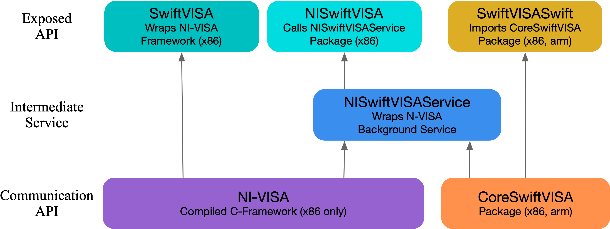
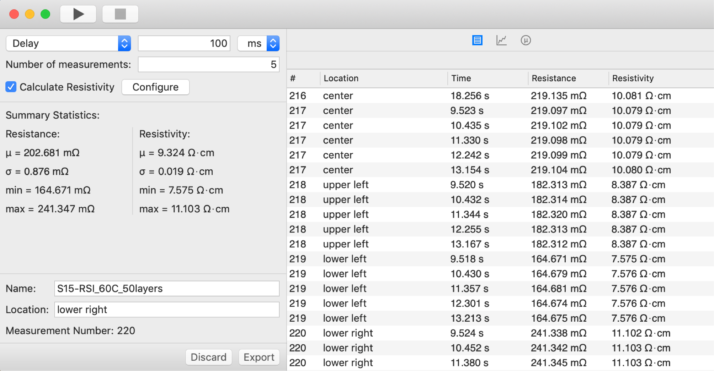
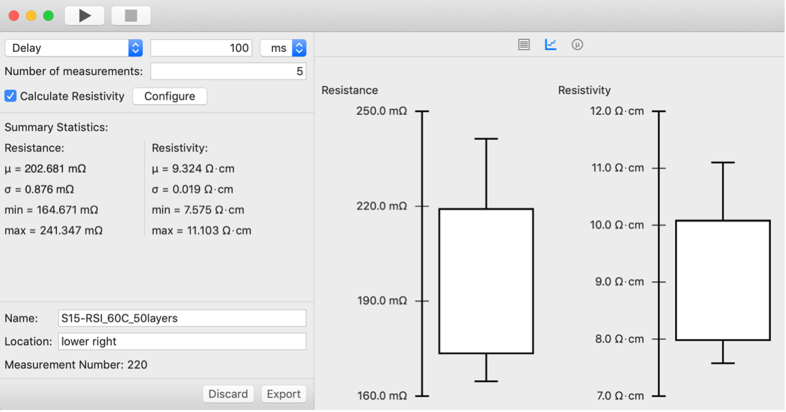
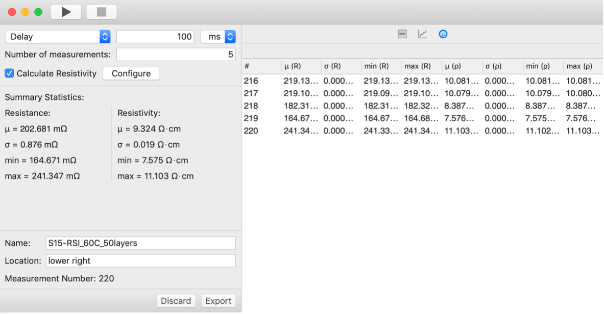

---
title: 'SwiftVISA: Controlling Instrumentation with a Swift-based Implementation of the VISA Communication Protocol'
tags:
  - Swift
  - VISA
  - instrument control
  - instrumentation
authors:
  - name: Connor Barnes
    affiliation: 1
  - name: Luke Henke
    affiliation: 1
  - name: Lorena Henke
    affiliation: 2
  - name: Ivan Krukov
    affiliation: 1
  - name: Owen Hildreth^[corresponding author]
    orcid: 0000-0001-5358-9080
    affiliation: 1
affiliations:
  - name: Colorado School of Mines
    index: 1
  - name: Consolidated Analysis Center, Incorporated
    index: 2
date: 20 October 2022
bibliography: bibliography.bib

---

# Summary

The Virtual Instrument Software Architecture (VISA)[@GH_VISA_overview; @NI-VISA_download; @wiki_VISA] is a simple Application Programming Interface (API) to communicate with test and measurement instrumentation from a computer.  VISA includes specifications for communicating with resources or instruments over GPIB (General Purpose Interface Bus, IEEE-488) and VXI (VME eXtensions for instrumentation), which are test and measurement specific I/O interfaces along with providing protocols for communicating over PC-Standard I/O standards, such as VXI-11 (over TCP/IP), UCSBTMC (USBTest and Measurement Class, over USB), HiSLIP (High Speed LAN Instrument Protocol).[@wiki_VISA]  VISA's ability to communicate with a wide variety of instruments over a broad range of I/O's using a common set of APIs makes it an attractive communication API for scientists and equipment manufacturers to write equipment control software with.

Over the years, VISA has been wrapped or ported to other languages in an effort to make it easier to write programs to control instruments and analyze their data in real time.  This paper introduces `SwiftVISASwift`,[@GH_SwiftVISASwift] a pure Swift-based VISA implementation for use on both x86 and ARM-based processors.  `SwiftVISASwift` allows scientists and engineers to write full-featured, native iOS and macOS applications while leveraging standardized SCPI commands to control their instrumentations.  Unlike other VISA implementations, such as `PyVISA`, `SwiftVISASwift` provides native access to standard iOS and macOS APIs and works well with asynchronous programming methodologies.  This paper details the design and basic use of packages and frameworks in the SwiftVISA project.

# Statement of Need

The VISA framework is a key backbone for many research instruments.  Its syntax is versatile, easy to learn, and adaptable to low and high throughput data streams.   It's original C implementation makes it easy to wrap a pre-compiled framework (such as `NI-VISA`) in different languages.  `PyVISA` is a good example of this and is one of the most widely known and used implementations of this strategy.[@PyVISA]  `PyVISA` is highly portable between operating systems and python itself is relatively easy to learn.  However, wrapping the VISA framework comes with the limitations associated with any wrapper.  For example, the VISA framework hasn't been compiled for ARM processors and `PyVISA` (and other wrappers) are limited to x86 processors.  Additionally, pre-compiled frameworks aren't as portable as packaged-based distribution methods.  `PyVISA-py` has worked to address some of these issues by re-implementing VISA entirely in Python.[@GH_PyVISApy]  However, `PyVISA-py` still doesn't have  access to the Operating System's APIs.

Inspired by `PyVISA` and `PyVISA-py`, we have developed a collection of Swift-based wrappers, services, and packages to control VISA-compliant instruments using applications written in Swift for computers running macOS.  

 `SwiftVISASwift` as a Swift-based VISA package that doesn't require a pre-compiled VISA framework.  This package allows developers to write full featured macOS and iOS applications to control their instruments.  Since `SwiftVISASwift` is delivered as a package instead of a framework, it can be compiled against a wide range of hardware platforms and supports x86 and ARM processors and can be used in Universal Binaries.  This manuscript will summarize `SwiftVISASwift` and example some simple code examples.

# VISA Overview

This section provides a brief overview of VISA to better understand the purpose of this project and some of the key terminology used throughout this publication.[@GH_VISA_Background; @GH_VISA_Terminology_Resource]  VISA was originally standardized through the VXIplug&play alliance and is currently maintained by the IVI Foundation.[@wiki_VISA]  The purpose of the VISA API is to provide a set of standard, consistent architecture to communicate with Test and Measurement (T&M) instruments that is reasonably independent of the interface bus and is consistent across devices of similar types.  For example, a programmer should be able use the same code to control multimeters made by different manufacturers (assuming the  instruments' capabilities are the same).  Additionally, even if the capabilities are different, the API to control similar aspects of different instruments is often the same.  One nice aspect of the API is that many of the VISA Commands use to control instruments consist of simple text strings passed using a standard communication interface (USB, TCP/IP, etc.).

It is important to understand some of VISA's Resource terminology.[@GH_VISA_Terminology_Resource]  A Resource is an instrument connected to your system and the Resource provides a complete description of the set of capabilities for the instrument.  There are several types of VISA resources: INSTR, MEMACC, INTFC, BACKPLANE, SERVANT, SOCKET, and RAW.  According to the National Instruments VISA Resources page, most VISA applications and instrument drivers use only the INSTR resource.[@GH_VISA_Terminology_Resource]  The Resource's Interface often describes a concatenation of the communication protocol with the Resource Type. For example, a resource communicating over USB using the Instrument Type would be called a USB::INSTR.  Communicating over TCP/IP using a Socket type would be TCPIP::SOCKET.  

While the VISA API provides a simple programming interface to control various T&M instruments, a set of frameworks and drivers are necessary to handle communication between the devices and the computer.  This is often handled using the pre-compiled National Instruments VISA framework, NI-VISA.  This C-based framework can communicate with a broad range of instrument types using a broad range of communication protocols.  Overall, NI-VISA is a good starting place when writing T&M instrument control software. However, writing GUI-based software in C is harder than using more modern programming languages, such as python, C++, Swift, etc.  As a result, there is a large community of programmers and scientists writing wrappers around the NI-VISA framework[@pyVISA; @GH_SwiftVISA; @GH_GOwrapper; @GH_JuliaWrapper] or writing their own VISA implementation[@GH_pyVISApy; @GH_SwiftVISASwift] in their preferred language.

# SwiftVISASwift Overview
`SwiftVISASwift` has evolved over the years from `SwiftVISA`, a `PyVISA` inspired wrapper around the pre-compiled `NI-VISA` C-framework, to an intermediate backend service combined with higher level APIs implemented as a Swift Package, to finally a pure Swift implementation of the VISA framework.  

The 'SwiftVISASwift' package is broken into four sub-implementations to provide developers with the widest design freedoms.  These are:

* `CoreSwiftVISA`[@GH_CoreSwiftVISA]
* `SwiftVISASwift`[@GH_SwiftVISASwift]
* `NISwiftVISA`[@GH_NISwiftVISA]
* `SwiftVISA` (deprecated)[@GH_SwiftVISA]

The figure below shows how these implementations work together and provide options to developers based upon their needs.  `SwiftVISA` and `NISwiftVISA` still depend on the pre-compiled `NI-VISA` framework and provides access to GPIB::INSTR, USB::INSTR, and TCPIP::INSTR and TCPIP:SOCKET communication.  However, since they ultimately rely on `NI-VISA`, they are limited to x86 systems and, at the time of this writing, to macOS 11 and below (National Instruments hasn't yet released `NI-VISA` that works on macOS 12 yet.  The `SwiftVISASwift` package uses the underlying `CoreSwiftVISA` package to provide a pure Swift implementation that works on x86 and ARM processors and is compatible with macOS 12.  However, only TCP/IP communication as TCPIP::SOCKET instruments has been implemented for `SwiftVISASwift`.  USB instruments were not implemented due Apples restrictions placed on the kernel extensions (kext) needed to communicate with USB devices starting with macOS 12.  Also, as of this time, getting access to the entitlements required to use the newer DriverKIT API to communicate with USB devices is limited to original equipment manufacturers and it doesn't appear that one can write a general set of drivers that works for multiple manufacturers at this time.  For this reason, SwiftVISASwift is limited to communicating over TCP/IP.

`CoreSwiftVISA` is a low-level package that provides a base, underlying implementation of SwiftVISA, excluding the communication implementation portion (i.e. TCI/IP, USB, etc.).  This includes defining base types and protocols.  `CoreSwiftVISA` isn't directly used, instead, it is used by higher-level packages, such as `SwiftVISASwift` and `NISwiftVISA`.  Breaking the core components out into a separate package makes it simpler to abstract away implementation details.  This can be used to create custom backends for SCPI-compliant instruments or other types of instruments. 

`SwiftVISASwift` uses `CoreSwiftVISA` types and protocols and implements communication over TCI/IP instruments.  This is a pure Swift, native backend that does not require installation of the VISA or NI-VISA frameworks.  `SwiftVISASwift` is currently limited to communicating with TCI/IP instruments using the IPAddress:SOCKET configuration.  It does not yet implement VX11.  While we are working on implementing USB support, progress is slow because communication on iOS and macOS devices now requires signed drivers.  While it is possible to use older USB drivers, macOS has started restricting kexts and breaking out the implementation into those that did and didn't require signed drivers was considered more future-proof.

`NISwiftVISA` allows for communicating over USB instruments.  This implementation does use the `NI-VISA C` backend and requires that users have `NI-VISA` 20.0 or later installed.  Additionally, users must install `NISwiftVISAService`.[@GH_NISwiftVISAService]  The `NISwiftVISAService` is a process that runs in the background that allows the NISwiftVISA framework to communicate with `NI-VISA`'s `C` framework. This service is necessary because NI only distributes pre-compiled binaries of its NI-VISA framework and, at the time we wrote NISwiftVISA, Swift Packages did not support dependencies on pre-compiled binaries within a package.  While Swift 5.3 introduced dependencies for binary dependencies, they were limited to XCFrameworks.  NI-VISA is not an XCFramework.  To circumvent this requirement, the `NISwiftVISA` uses inter-process communication that calls the `NISwiftVISAService`, which handles all communicates to the instruments.  `NISwiftVISA` works well on macOS systems, but is not compatible with iOS systems.  Additionally, unless the NI-VISA framework is updated to a universal framework, it will run under ARM systems (e.g. Apple Silicon) through Apple's Rosetta 2 dynamic binary translator.  Just as Apple's Rosetta 1 translator was eventually Obsolete and unavailable, we can expect Rosetta 2 to also be phased out eventually.

`SwiftVISA` was our original implementation and is simply a wrapper, like `PyVISA`, around the `NI-VISA` framework.  This requires that `NI-VISA` framework is installed and is limited to macOS devices.   `SwiftVISA` is considered deprecated at this point and we do not expect to provide any future updates.  Even though it is deprecated, `SwiftVISA` still functions and we have tested it up to macOS 11.1 (if SIPS is disabled).  It does not work on ARM processors and doesn't work on macOS 12 at this time.

# Features
`SwiftVISASwift` allows direct communication with `SCPI`-compliant devices in an easy, and accessible manner.  The `SwiftVISASwift` implementation requires no external frameworks for TCI/IP devices while the `NISwiftVISA` implementation allows for communication with USB and GPIB (along with TCI/IP) devices while using the `NISwiftVISAService` background process to bypass the need for importing the `NI-VISA` framework directly into your package or application.  Additionally, `SwiftVISASwift` is compatible with Swift 5.5's new built-in support for writing asynchronous and parallel code in a structured way.  This includes concurrency features such as `async-await`, `actor`, `Task`.  As a result, it is easy to define instrument controllers as Actors and ensure that sending commands and collecting data from the instrument doesn't tie up the main thread or GUI.

The following example demonstrates some basic functionalities.  A complete example demonstrating a typical workflow using the `SwiftVISASwift` package with a TCI/IP compatible device.

`SwiftVISASwift` is first imported as a package through Swift Package Manager.  To use `SwiftVISASwift` in your project, include the following dependency in your `Package.swift` file.
	
	dependencies: [.package(url: 
	   "https://github.com/SwiftVISA/SwiftVISASwift.git", 
	   .upToNextMinor(from: "0.1.0")) ]
	
To create a connection to an instrument over TCP/IP, pass the network details to `InstrumentManager.shared.instrumentAt(address:port:)`.  Since this operation can throw an error if it fails you can either use a `do-catch` statement to handle the error or have the calling function throw the error up your chain.
	
	do {
		// Pass the IPv4 or IPv6 address of the instrument
		// to "address" and the instrument's port to "port".
		let instrument = try InstrumentManager.shared
		   .instrumentAt(address: "10.0.0.1", port: 5025)
	} catch {
		// Could not connect to instrument
		// Handle the error
	}
	
To write to the instrument, call `write(_:)` on the instrument:
	
	do {
		// Pass the command as a string.	
		try instrument.write("OUTPUT ON")
	} catch {
		// Could not write to instrument
		// Handle the error
	}

To read from the instrument, call `read()` on the instrument:
	
	do {
		try instrument.write("VOLTAGE?")
		let voltage = try instrument.read() 
		// read() returns a String
	} catch {
		// Could not read from (or write to) instrument
		// Handle the error
	}

The `actor` branch of `SwiftVISASwift` is designed to support Swift 5.5's concurrency features.  This allows users to easily send connect and communicate with instruments without blocking the main thread.  For example, the code below creating a new Message Based Instrument is asynchronous because the underlying `TCPIPSession` in `SwiftVISASwift` is marked as an `actor` and all instrument creation ultimately uses a `TCPIPSession` to setup the communication between the application and the device.  This small, easy to implement change, reduces a lot of UI hang-ups if the device isn't connected or configured correctly.   The code shows how to asynchronously instantiate a new Message Based Instrument.  Doing this asynchronously means that the main thread will not be tied up during the timeout period if, for instance, the device wasn't connected or powered on or configured properly.  

	func makeInstrument() async throws -> MessageBasedInstrument {
	    var instrument = try await InstrumentManager.shared
	       .instrumentAt(
	          address: address,
	          port: port,
	          timeout: timeout
	       )
	    instrument.attributes = attributes
	    return instrument
	  }

Extending this asynchronous behavior to your own custom instrument controllers is also simply a matter of marking your controllers as an `actor` instead of a class.  Using a waveform generator as and example, the code below creates a `WaveformController` marked as a `public actor` and then an extension is added to read and set the waveform generator's voltage.  Using an actor instead of a class ensures that communicating with the instrument does not block the main thread.

	public actor WaveformController {
	  var instrument: MessageBasedInstrument
	  
	  init(instrument: MessageBasedInstrument) {
	    self.instrument = instrument
	  }
	}
	
	
	extension WaveformController {
	  var rawVoltage: Double {
	    get async throws {
	      try await instrument.query("VOLT?", as: Double.self)
	    }
	  }
	
	  func setRawVoltage(to voltage: Double) async throws {
	    try await instrument.write("VOLT \(voltage)")
	  }
	}

# Example Applications

Internally, we've been using `SwiftVISA` and `SwiftVISASwift` for a few years now to control various laboratory hardware. Resistivity Utility is an example application written with `SwiftVISA` to control an Agilent Nanovolt meter connected to a custom 4-point probe station.  This simple application lets us document our measurements, apply the appropriate geometry corrections for resistivity calculations, and export both the raw and summarized data to csv files.[@GH_resistiv]

# Current Limitations and Future Work
`SwiftVISA` and `NISwiftVISA` have many of the features available to `PyVISA` and NI-VISA, with the following known exceptions: 

* The `list_resources` function available in `PyVISA` is currently not supported
* There is not plan to implement direct GPIB connections.  However, we have used GPIP-to-USB converters to communicate and control legacy GPIB devices[@GH_resistiv]
* Communication using HiSLIP has not been tested or confirmed

Since `SwiftVISASwift` is still a young effort and currently only works with `TCPIP::SOCKET`.  In the near future, we plan to:

* Implement USB communication
* Implement a `listResources` function equivalent to PyVISA's `list_resources` function
* Implement VXI-11 communication and resource addresses

The long-term plans listed below would require help from the broader community.

* Testing HiSLIP communication
* Support `PXIInstrument`
* Support `VXIInstrument`

There are no plans in `SwiftVISASwift` to directly support `GPIBInstrument` or `FirewireInstrument` given that these legacy connections re not in widespread use.  However, we have used GPIB-to-USB and GPIB-to-TCIIP adapters[@prologix] to control our instruments with SwiftVISA` and SwiftVISASwift` respectively.  These adapters were chosen because they don’t require additional drivers, making them platform independent.

# Contributions
Connor Barnes, Luke Henke, Lorena Henke, and Ivan Krukov wrote the original SwiftVISA framework[@GH_SwiftVISA] wrapping the pre-compiled NI-VISA framework[@NI-VISA_download] with Owen Hildreth supervising their work.  Connor Barnes continued to work and develop the rest of the frameworks, services, and Swift packages in the SwiftVISA organization.  Owen Hildreth continues to supervise the work and maintain the repositories.

# Acknowledgements
We would like to acknowledge the financial support we received from the National Science Foundation (Award #: CAREER 401756).

# References
